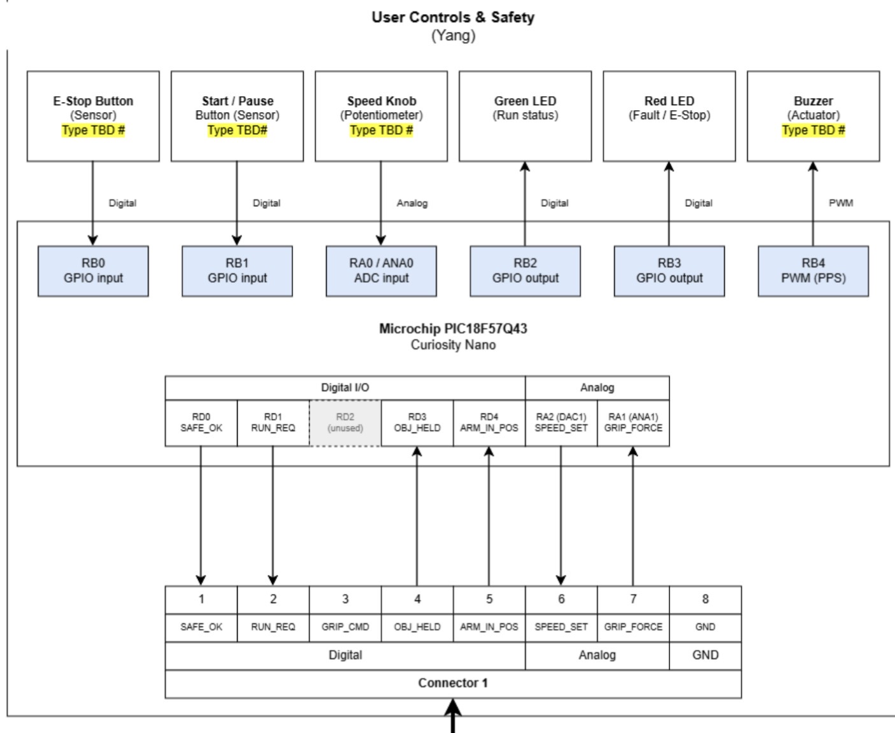

# Individual Block Diagram

## Overview

This block diagram describes the **User Controls & Safety subsystem** of the project.

The subsystem is controlled by a **Microchip PIC18F57Q43 Curiosity Nano**. 
It receives user inputs, monitors system control signals, and provides visual 
and audible status indications.

The main sensors and user inputs include:

- **E-Stop Button** – digital safety input
- **Start / Pause Button** – digital user input
- **Speed Knob (Potentiometer)** – analog speed command input

The main actuators and status outputs include:

- **Green LED** – indicates normal running status
- **Red LED** – indicates a fault or E-Stop condition
- **Buzzer** – provides an audible warning

The subsystem communicates with the other project subsystems through 
**Connector 1**, which contains digital signals, analog signals, and ground.

The primary inter-system signals are:

- SAFE_OK
- RUN_REQ
- GRIP_CMD
- OBJ_HELD
- ARM_IN_POS
- SPEED_SET
- GRIP_FORCE
- GND

Power for the subsystem is provided through the project power system and 
distributed to the microcontroller, user controls, sensors, LEDs, and buzzer.

## Block Diagram

